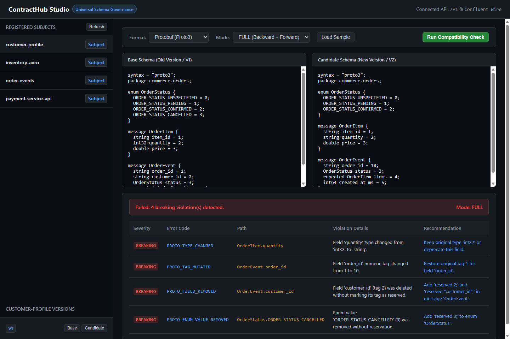
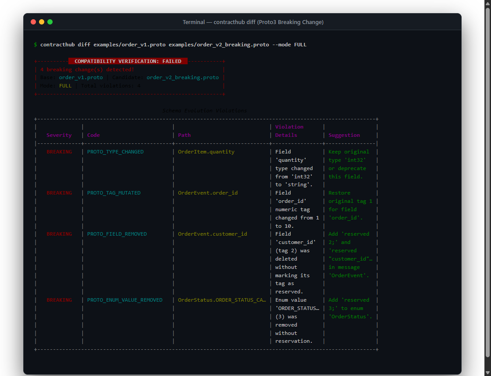
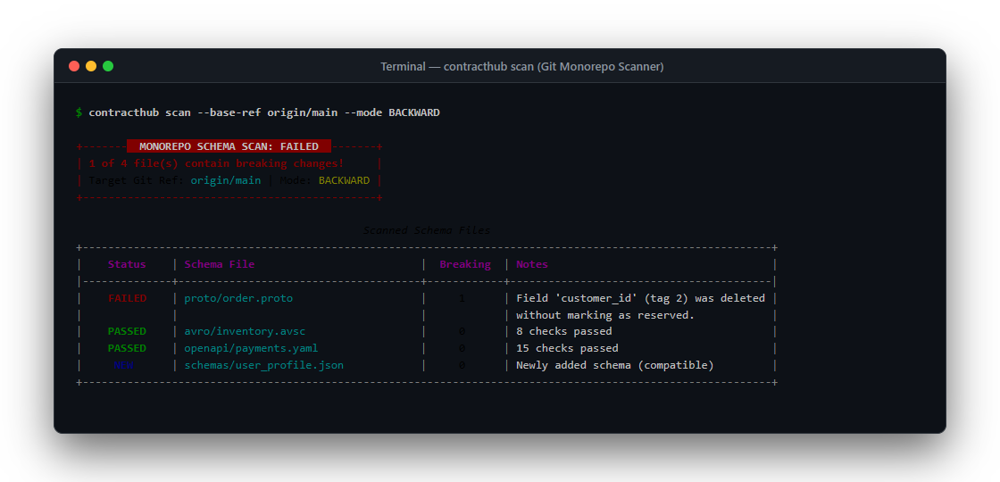

<p align="center">
  
</p>

<h1 align="center">ContractHub</h1>

<p align="center">
  <a href="https://github.com/alexandrmotologa/contracthub/actions"></a>
  
  
  
  
</p>

<p align="center">
  <strong>Schema Registry & Breaking Change Linter for Protobuf, Avro, OpenAPI, and JSON Schema with wire-compatible Confluent Schema Registry endpoints and CI gating.</strong>
</p>

---

ContractHub is a schema registry and breaking change linter for Protocol Buffers (Proto3), Apache Avro (.avsc), OpenAPI 3.x, and JSON Schema. It helps teams maintain data compatibility across event streams and HTTP services by analyzing schema syntax trees, checking semantic rules, and blocking incompatible pull requests in CI pipelines.

ContractHub also exposes a wire-compatible API for Confluent Schema Registry clients, so Kafka producers and consumers can register and fetch schemas without code changes.

<p align="center">
  
</p>

## Features

- AST-level compatibility checks for Proto3, Apache Avro (.avsc), OpenAPI 3.x, and JSON Schema.
- Three compatibility modes: BACKWARD, FORWARD, and FULL.
- Semantic Versioning (SemVer) recommendation engine (`MAJOR`, `MINOR`, `PATCH`) based on schema diffs.
- Live Payload Validator checking JSON payloads against Proto, Avro, OpenAPI, and JSON Schema.
- CLI suite (`contracthub diff`, `contracthub check`, `contracthub scan`, `contracthub fix`, `contracthub mock`, `contracthub semver`, `contracthub validate`).
- Monorepo scanner with automatic git diff detection and GitHub Actions Markdown summaries.
- Auto-remediation engine to automatically preserve deleted Protobuf tags and names with `reserved`.
- Synthetic mock data generator producing realistic JSON payloads from schemas.
- Outbound Webhooks with HMAC-SHA256 signatures for schema registration and compatibility alerts.
- Confluent Schema Registry wire-compatible HTTP endpoints (`/subjects`, `/schemas/ids/{id}`, `/compatibility/subjects/{subject}/versions/{version}`).
- Built-in Web Studio (`/studio`) with subject explorer, version history viewer, and candidate diff testing.
- Standalone GitHub Action (`alexandrmotologa/contracthub@v1`) with monorepo scanning support.
- Local SQLite storage by default, with support for PostgreSQL.

## Compatibility Rules

### Protocol Buffers (Proto3)

| Rule | Severity | Condition |
| :--- | :--- | :--- |
| `PROTO_FIELD_REMOVED` | BREAKING | Field deleted without marking its tag as `reserved` |
| `PROTO_TAG_MUTATED` | BREAKING | Existing field assigned a different numeric tag |
| `PROTO_TYPE_CHANGED` | BREAKING | Field data type changed (for example, `string` to `int32`) |
| `PROTO_TAG_COLLISION` | BREAKING | Field uses a tag number previously marked as reserved |
| `PROTO_ENUM_VALUE_REMOVED` | BREAKING | Enum value name or number deleted |
| `PROTO_MESSAGE_REMOVED` | BREAKING | Top-level or nested message removed |

### OpenAPI 3.x

| Rule | Severity | Condition |
| :--- | :--- | :--- |
| `REST_ENDPOINT_REMOVED` | BREAKING | URL path removed from the specification |
| `REST_METHOD_REMOVED` | BREAKING | HTTP method removed from an existing path |
| `REST_REQUIRED_PARAM_ADDED` | BREAKING | New required query, header, or path parameter introduced |
| `REST_REQUIRED_BODY_ADDED` | BREAKING | Request body made required or new required property added |
| `REST_STATUS_MUTATED` | BREAKING | Expected response status code altered or removed |
| `REST_RESPONSE_TYPE_MUTATED` | BREAKING | Response property type changed incompatibly |

### JSON Schema

| Rule | Severity | Condition |
| :--- | :--- | :--- |
| `JSON_SCHEMA_REQUIRED_ADDED` | BREAKING | New field added to `required` array in candidate schema |
| `JSON_SCHEMA_TYPE_NARROWED` | BREAKING | Allowed type set reduced (for example, `["string", "null"]` to `string`) |
| `JSON_SCHEMA_PROPERTY_REMOVED` | BREAKING | Property removed when `additionalProperties: false` is configured |

### Apache Avro (.avsc)

| Rule | Severity | Condition |
| :--- | :--- | :--- |
| `AVRO_FIELD_ADDED_NO_DEFAULT` | BREAKING | New field added without a default value (breaks backward compatibility) |
| `AVRO_FIELD_REMOVED_NO_DEFAULT` | BREAKING | Existing field removed without a default value (breaks forward compatibility) |
| `AVRO_TYPE_MUTATED` | BREAKING | Field data type changed incompatibly |

## Installation

Using `uv`:

```bash
uv pip install contracthub
```

Or using standard `pip`:

```bash
pip install contracthub
```

For local development:

```bash
git clone https://github.com/alexandrmotologa/contracthub.git
cd contracthub
uv sync
```

## Quick Start

### 1. Diff two local schemas

Compare two files directly to verify whether an update is safe:

```bash
# Compare two Proto files
contracthub diff examples/order_v1.proto examples/order_v2_compatible.proto

# Check with strict FULL compatibility
contracthub diff examples/order_v1.proto examples/order_v2_breaking.proto --mode FULL
```

The command returns exit code `0` if compatible, or exit code `1` if breaking changes exist.

<p align="center">
  
</p>

### 2. Run the Registry Server & Web Studio

Start the local registry server:

```bash
contracthub serve --port 8000
```

Access the interactive interfaces:
- Web Diff Studio: `http://localhost:8000/studio`
- OpenAPI Documentation: `http://localhost:8000/docs`

### 3. Check against a registered subject

Validate a working file against the latest version stored in your registry:

```bash
contracthub check --subject order-events --file schemas/order.proto --url http://localhost:8000
```

### 4. Register a new schema version

Register an approved schema into the registry:

```bash
contracthub register --subject order-events --file schemas/order.proto --url http://localhost:8000
```

### 5. Scan a Git monorepo for changed schemas

Scan all modified schemas between your branch and a base reference:

```bash
contracthub scan --base-ref origin/main --mode BACKWARD
```

You can also output a GitHub Actions job summary:

```bash
contracthub scan --base-ref origin/main --github-summary $GITHUB_STEP_SUMMARY
```

<p align="center">
  
</p>

### 6. Auto-remediate breaking Protobuf changes

Automatically preserve removed tags and names by appending `reserved` directives:

```bash
# Preview modifications
contracthub fix --base examples/order_v1.proto --candidate examples/order_v2_breaking.proto

# Apply in-place to candidate file
contracthub fix --base examples/order_v1.proto --candidate examples/order_v2_breaking.proto --write
```

### 7. Generate synthetic mock payloads

Produce mock JSON data directly from a schema file or the REST API:

```bash
contracthub mock --file examples/order_v1.proto --message Order --output mock_order.json
```

### 8. Automated SemVer Bump Recommendation

Analyze schema evolution to determine whether a changesets requires a `MAJOR`, `MINOR`, or `PATCH` version bump:

```bash
contracthub semver examples/order_v1.proto examples/order_v2_breaking.proto --current-version 1.4.0
```

### 9. Live Payload Validation

Validate real JSON payloads or API responses against schema files:

```bash
contracthub validate --file examples/customer_v1.json --payload payload.json
```

## GitHub Action Usage

ContractHub can check specific schema files or scan an entire monorepo automatically.

### Monorepo automatic scan

```yaml
name: Contract Linter

on:
  pull_request:
    branches: [main]

jobs:
  lint:
    runs-on: ubuntu-latest
    steps:
      - uses: actions/checkout@v4
        with:
          fetch-depth: 0
      - uses: alexandrmotologa/contracthub@v1
        with:
          base-ref: 'origin/main'
          mode: 'BACKWARD'
```

### Targeted single-file check

```yaml
      - uses: alexandrmotologa/contracthub@v1
        with:
          file: 'proto/order.proto'
          base-ref: 'origin/main'
          mode: 'FULL'
```

## Outbound Webhooks

ContractHub sends signed HTTP POST payloads whenever schemas are registered or rejected.

Register a webhook endpoint:

```bash
curl -X POST http://localhost:8000/v1/webhooks \
  -H "Content-Type: application/json" \
  -d '{"url": "https://api.example.com/events", "secret": "webhook-secret-token"}'
```

Every delivery includes the following headers:
- `X-ContractHub-Event`: Event identifier (`VERSION_REGISTERED` or `COMPATIBILITY_REJECTED`)
- `X-ContractHub-Signature`: HMAC-SHA256 hex signature computed with your secret
- `X-ContractHub-Delivery`: Unique UUID for the delivery attempt

## Confluent Schema Registry Compatibility

ContractHub implements the Confluent wire protocol. Existing Kafka clients can point directly to ContractHub:

```python
from confluent_kafka.schema_registry import SchemaRegistryClient

client = SchemaRegistryClient({"url": "http://localhost:8000"})
latest_version = client.get_latest_version("order-events")
print(f"Version: {latest_version.version}, Schema ID: {latest_version.schema_id}")
```

Supported Confluent endpoints:
- `GET /subjects`
- `GET /subjects/{subject}/versions`
- `GET /subjects/{subject}/versions/{version}`
- `POST /subjects/{subject}/versions`
- `GET /schemas/ids/{id}`
- `POST /compatibility/subjects/{subject}/versions/{version}`

## Documentation

Detailed guides are available in the `docs/` directory:
- [Architecture & Design](docs/architecture.md)
- [Compatibility Modes & Rules](docs/compatibility-rules.md)
- [CLI Reference](docs/cli-reference.md)
- [REST API Reference](docs/api-reference.md)

## License

MIT License. See [LICENSE](LICENSE) for details.
